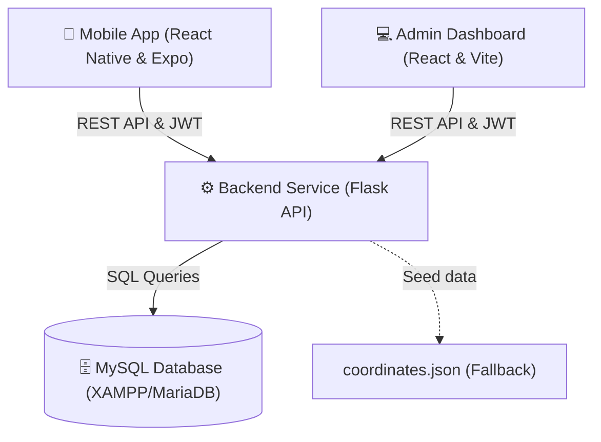

# 🧭 Redeemer's University (RUN) Campus Navigation System

A comprehensive, full-stack campus navigation and event tracking ecosystem tailored specifically for Redeemer's University (RUN). This system helps students, staff, and visitors locate campus points of interest (lecture theatres, hostels, administration offices, cafes, etc.), plan routes with dynamic ETAs, check scheduled campus events, and manage their student profiles. It also features a web-based administrative dashboard for real-time moderation, system activity auditing, and campus data updates.

---

## 🏗️ Project Architecture

The system consists of three main components:



1. **Backend Service (`joshua_backend`)**: A Flask web API that handles authentication, JWT session token validation, location and event CRUD requests, saved routes, SMTP mail transmissions for OTP codes, and active audit logs.
2. **Admin Web Dashboard (`admin`)**: A modern React SPA (Vite + TypeScript + TailwindCSS) enabling administrative personnel to manage campus listings, approve new user submissions, inspect real-time system audit logs, and oversee accounts.
3. **Mobile Client (`native`)**: A cross-platform mobile app built on React Native & Expo using TailwindCSS (via NativeWind) for maps, navigation, routing (OpenRouteService API), profile management, and event bookings.

---

## ✨ Features

### 📱 1. Mobile Application (`native`)
*   **Interactive Navigation & Maps**: Displays a highly optimized MapView displaying key university buildings, halls, faculties, and landmarks.
*   **Route Calculation**: Generates accurate path lines from the user's current location to destinations, complete with distance metrics and estimated time of arrival (ETA).
*   ** Redential verification**: Strict sign-up validation requiring university emails ending in `@run.edu.ng`.
*   **OTP Security**: Implements 6-digit OTP verification codes via email during signups and password recovery.
*   **Directions Bookmarking**: Users can bookmark or delete frequently traveled paths for instantaneous retrieval.
*   **Live Event Calendar**: Highlights sanctioned campus activities, with built-in coordinates to navigate straight to the event location.
*   **Dynamic Profiles**: Keeps track of student details (ID, faculty, academic level).

### 💻 2. Admin Dashboard (`admin`)
*   **Visual KPIs & Insights**: Real-time panels representing total registered students, verified users, locations, and events.
*   **Location Management Panel**: Full CRUD control to add new campus buildings, configure types, coordinates, and attach floorplans or images.
*   **Content Approval Workflows**: Separate validation queue to approve/reject locations or events posted by student groups.
*   **Audit Logger**: Live tracking records tracking administrators and user activities, mapping IP addresses, user emails, and performed operations.
*   **User Management**: Monitor verified roles, upgrade user accounts to admins, or wipe invalid/violating profiles.

### ⚙️ 3. Flask Backend API (`joshua_backend`)
*   **Token-Based Security**: Employs `@token_required` and `@admin_required` decorators using HS256-signed JWTs.
*   **OTP Dispatcher**: Directly integrates with SMTP services to securely fire authentication codes.
*   **Auto-Migration & Database Seeders**: Initialization scripts verify database structure and automatically seed values from `coordinates.json` if table data is empty.

---

## 🗄️ Database Schema

The database relies on MySQL (usually run via XAMPP). The structure consists of five main tables:

| Table Name | Description | Key Fields |
| :--- | :--- | :--- |
| **`users`** | Holds all user and administrator accounts. | `id`, `name`, `email` (Unique), `password` (Bcrypt), `role` (`user`/`admin`), `is_verified`, `otp_code`, `otp_expires_at`, `student_id`, `faculty`, `level`, `created_at` |
| **`locations`** | Coordinates, names, and images of campus landmarks. | `id`, `name`, `type`, `latitude`, `longitude`, `image` (Base64), `description`, `approval_status`, `floorplan`, `created_at` |
| **`events`** | University schedules and event specifications. | `id`, `title`, `description`, `locationName`, `date`, `time`, `status`, `image`, `author`, `approval_status` |
| **`saved_directions`** | Custom routing configurations bookmarked by students. | `id`, `user_id` (FK to `users`), `origin_name`, `origin_lat`, `origin_lng`, `destination_name`, `destination_lat`, `destination_lng`, `created_at` |
| **`audit_logs`**| Historical tracking logs of user actions and requests. | `id`, `user_id` (FK to `users`), `user_email`, `action`, `details`, `ip_address`, `created_at` |

---

## 🚀 Getting Started

### Prerequisites
*   [Python 3.10+](https://www.python.org/)
*   [Node.js 18+](https://nodejs.org/)
*   [XAMPP](https://www.apachefriends.org/) (for MySQL / MariaDB server)
*   Expo Go app on iOS/Android or emulator setups.

---

### 1. Database Setup

1. Open **XAMPP Control Panel** and start **Apache** and **MySQL**.
2. Open **phpMyAdmin** (`http://localhost/phpmyadmin`) in your web browser.
3. Create a new database named **`flask_database`** (or whatever name you configure in your `.env` file).
4. Import the SQL structure by running the backup script **`xampp_backup.sql`** at the root of the project:
   ```bash
   # You can import it through the phpMyAdmin "Import" tab by selecting xampp_backup.sql
   ```

---

### 2. Backend Installation & Run (`joshua_backend`)

1. Navigate to the backend directory:
   ```bash
   cd joshua_backend
   ```
2. Create and activate a Python virtual environment:
   ```bash
   # Windows PowerShell
   python -m venv venv
   .\venv\Scripts\Activate.ps1
   
   # Git Bash / Linux
   python -m venv venv
   source venv/bin/activate
   ```
3. Install dependencies:
   ```bash
   pip install -r requirements.txt
   ```
4. Create a `.env` file inside `joshua_backend` (use `.env.example` as a template):
   ```ini
   MYSQL_HOST=localhost
   MYSQL_PORT=3306
   MYSQL_USER=root
   MYSQL_PASSWORD=
   MYSQL_DB=flask_database
   SECRET_KEY=your_secret_jwt_key
   
   # For sending verification OTPs
   MAIL_SERVER=smtp.gmail.com
   MAIL_PORT=587
   MAIL_USE_TLS=True
   MAIL_USERNAME=your_real_email@gmail.com
   MAIL_PASSWORD=your_app_password
   MAIL_DEFAULT_SENDER=your_real_email@gmail.com
   ```
5. Initialize the database schema and seed locations:
   ```bash
   python init_db.py
   ```
6. Fire up the development server:
   ```bash
   python app.py
   ```
   *The server runs locally by default at `http://127.0.0.1:5000`.*

---

### 3. Admin Dashboard Installation & Run (`admin`)

1. Navigate to the admin directory:
   ```bash
   cd ../admin
   ```
2. Install npm dependencies:
   ```bash
   npm install
   ```
3. Create a `.env` file inside the `admin` folder:
   ```ini
   VITE_API_URL=http://localhost:5000/api
   ```
4. Run the React app locally:
   ```bash
   npm run dev
   ```
   *Open `http://localhost:5173` in your browser to access the administrator panel.*

---

### 4. Mobile App Setup & Run (`native`)

1. Navigate to the native directory:
   ```bash
   cd ../native
   ```
2. Install npm packages:
   ```bash
   npm install
   ```
3. Create a `.env` file inside the `native` folder:
   ```ini
   EXPO_PUBLIC_API_URL=http://your-local-ip-address:5000
   EXPO_PUBLIC_GOOGLE_MAP_KEY=your_google_maps_api_key
   EXPO_PUBLIC_ORS_API_KEY=your_open_route_service_api_key
   ```
   > [!IMPORTANT]
   > For physical testing on Expo Go, replace `your-local-ip-address` with your computer's actual local IPv4 address (e.g., `192.168.1.50`) instead of `localhost` or `127.0.0.1`, and ensure your mobile phone is connected to the same Wi-Fi network.
4. Launch the Metro Bundler:
   ```bash
   npx expo start
   ```
5. Scan the QR code using your camera (iOS) or the Expo Go application (Android) to load the application.

---

## 📁 Project Structure Outline

```
Campus-Navigation-System/
├── admin/                    # React Web Dashboard (Vite)
│   ├── src/
│   │   ├── components/       # Layout structures
│   │   ├── pages/            # Admin pages (Dashboard, Approvals, Logs, Locations, etc.)
│   │   ├── services/         # API fetch instances
│   │   └── App.tsx           # Dashboard routing manager
│   ├── package.json
│   └── tailwind.config.js
├── joshua_backend/           # Flask REST Backend
│   ├── static/images/        # Server uploaded assets
│   ├── app.py                # Server entry point and API endpoints
│   ├── init_db.py            # Database schema creator and auto-seeder
│   ├── requirements.txt      # Backend Python dependencies
│   └── coordinates.json      # Backup locations configuration file
├── native/                   # Expo React Native App
│   ├── src/
│   │   ├── app/              # Expo File-based routes
│   │   │   ├── (auth)/       # SignIn, SignUp, Verification
│   │   │   └── (tabs)/       # Home Map, Events list, Profile
│   │   └── components/       # Native UI components (Buttons, Inputs, etc.)
│   ├── package.json
│   └── app.json
└── xampp_backup.sql          # Base SQL Database backup
```

---

## 🛠️ Technology Stack Summary

*   **Frontend Web**: React, Vite, TypeScript, TailwindCSS, Lucide Icons, Axios.
*   **Mobile Mobile Client**: React Native, Expo, TypeScript, NativeWind (Tailwind), React Native Maps, Expo Router.
*   **Backend Server**: Python, Flask, Flask-Cors, Flask-Bcrypt, Flask-Mail, PyJWT, Python-dotenv.
*   **Database Systems**: MySQL, SQL Database structure.
*   **Routing API**: OpenRouteService (ORS) API.
